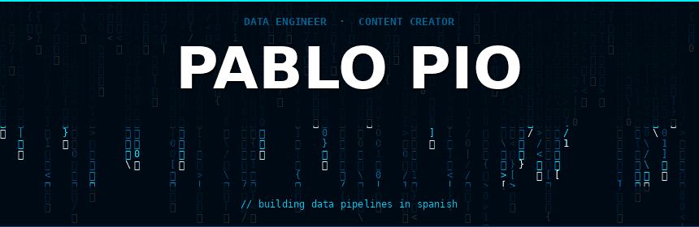

<!--
  ╔══════════════════════════════════════════════════════╗
  ║           PABLO PIO — github.com/pablopr3           ║
  ╚══════════════════════════════════════════════════════╝
-->

<div align="center">



<br/>


</div>

<br/>

```python
class PabloPio:
    name     = "Pablo Pio"
    roles    = ["Data Engineer", "Content Creator"]
    location = "Canary Islands, Spain"
    mission  = "Making Data Engineering accessible in Spanish"
    stack    = {
        "languages"    : ["Python", "SQL"],
        "transform"    : ["dbt", "Spark"],
        "orchestration": ["Airflow", "Kafka"],
        "infra"        : ["Docker", "Linux", "Git"],
    }
    community = {"tiktok": "@vortidev", "youtube": "@VortiDevv", "total": "+10K"}
    contact   = "pabloprdev@gmail.com"
```

<br/>

<div align="center">


**`[ STACK ]`**


</div>

<br/>

<div align="center">

<!-- Languages -->


<!-- Transform -->


<!-- Orchestration -->


<!-- Infra -->


</div>

<br/>

<div align="center">


**`[ STATS ]`**


</div>

<br/>

<div align="center">


</div>

<br/>

<div align="center">


**`[ CONNECT ]`**


</div>

<br/>

<div align="center">

[](https://www.tiktok.com/@vortidev)
[](https://www.youtube.com/@VortiDevv)
[](https://www.linkedin.com/in/pablo-pio-ramos-7501342b5/)
[](mailto:pabloprdev@gmail.com)

<br/>


</div>

<br/>

<div align="center">

</div>
